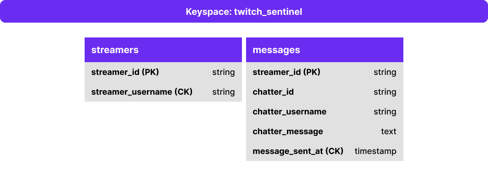

A Keyspace is a top-level container that stores tables with attributes that define how data is replicated on nodes. It defines several options that apply to all the tables it contains, the most important of which is the replication strategy used by the Keyspace. A keyspace is comparable to the concept of a Database Schema in the relational world.  

Since the keyspace defines the replication factor of all underlying tables, if we have tables that require different replication factors, we would store them in different keyspaces.
Create a keyspace and call it **twitch_sentinel**:

`CREATE KEYSPACE twitch_sentinel WITH REPLICATION = { 'class' : 'NetworkTopologyStrategy', 'replication_factor' : 3};`{{execute}}

