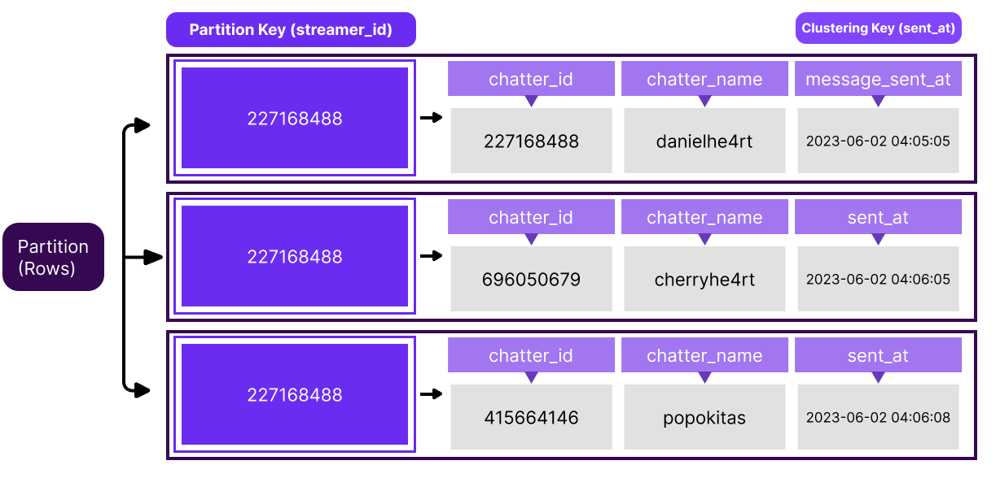

A Keyspace is a top-level container that stores tables with attributes that define how data is replicated on nodes. It defines several options that apply to all the tables it contains, the most important of which is the replication strategy used by the Keyspace. A keyspace is comparable to the concept of a Database Schema in the relational world.  

Since the keyspace defines the replication factor of all underlying tables, if we have tables that require different replication factors, we would store them in different keyspaces.
Create a keyspace and call it **twitch_sentinel**:

`CREATE KEYSPACE twitch_sentinel WITH REPLICATION = { 'class' : 'NetworkTopologyStrategy', 'replication_factor' : 3};`{{execute}}

and then to use the keyspace that we created you need to run: 

`use twitch_sentinel;`{{execute}}

> You need to be inside the CQLSH to run those commands.

Now we're good to go and create our tables and start developing our software!

## Modeling our First Tables

Twitch Sentinel has one task: retrieve and store messages from any twitch channel that we want. But what do we need to make it work?

At the beginning, we will need two tables:

- streamers
- messages

We will add more tables, but let's keep it simple.

`CREATE TABLE streamers (
   streamer_id text,
   streamer_username text,
   PRIMARY KEY (streamer_id)
);`{{execute}}

`CREATE TABLE messages (
   streamer_id text,
   chatter_id text,
   chatter_username text,
   chatter_message text,
   sent_at text,
   PRIMARY KEY (streamer_id, sent_at)
) WITH CLUSTERING ORDER BY (sent_at DESC);`{{execute}}

After created we can run the `DESC table_name;` to see if is everything working as expected.

`DESC streamers;`{{execute}}

`DESC messages;`{{execute}}

## Inserting Data

lorem ipsum