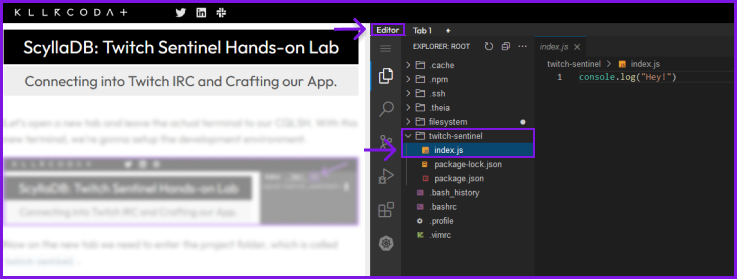

Let's open a new tab and leave the actual terminal to our CQLSH. Head to `Editor Tab` , we're gonna setup the development environment by downloading everything we need.



Now on the `Editor Tab` tab we need to enter the project folder, which is called `twitch-sentinel`. 

`cd twitch-sentinel`{{execute}}

After your terminal is also inside the project folder, we need to install the project dependencies. For this project we'll need only two:

- [ScyllaDB/Cassandra](https://www.npmjs.com/package/cassandra-driver) connector to NodeJS
- [tmi.js](https://tmijs.com/)(Twitch Chat Client). 


You can run the command below and install the dependencies: 

```sh
npm i tmi.js cassandra-driver
```{{execute}}

