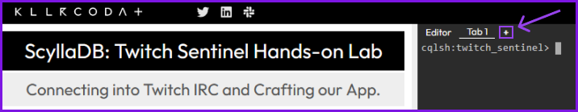

Let's open a new tab and leave the actual terminal to our CQLSH. With this new terminal, we're gonna setup the development environment.

Now on the new tab we need to enter the project folder, which is called `twitch-sentinel`. 

`cd twitch-sentinel`{{execute}}